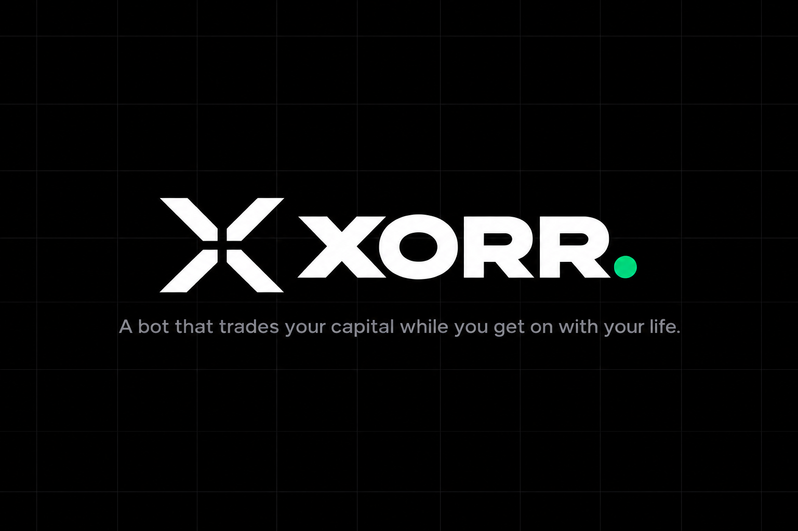

<p align="center">
  
</p>

# xorr — a council of AI agents that trades for you on Monad, inside a permission you can revoke

**Built for [Monad Metropolis](https://monad.xyz/developers/hackathons/metropolis) · track: Onchain Finance & Trading.**

Nobody can watch a market all night. xorr lets a council of AI agents do it for you — every trade voted on first, every
vote shown beside the transaction it produced, and none of it able to touch more than you allowed, because the chain
enforces the limit. On Monad a council can deliberate and still fill at the price it voted on: blocks land every 400 ms.

**Demo (2:59, recorded from the running app):** [`docs/demo/xorr-monad-demo.mp4`](docs/demo/xorr-monad-demo.mp4).

## What works today

**Sign in with a passkey (Mera).** The account is derived from the passkey on the device — PRF output → BIP-39 →
`m/44'/60'/0'/0/0` — so the same passkey gives the same wallet on any device, and nothing that can sign is stored. The
executor verifies a signed challenge and issues its own session; signatures come from a Mera signing session that opens
for 15 minutes (Settings shows the countdown and a lock), then asks the passkey once more. A second key from the same
passkey, under its own PRF salt, encrypts **private notes** on each trade: the server stores ciphertext it cannot read,
and the passkey opens them on any device. (Web; the phone app needs a passkey domain and a development build. Email
sign-in through Privy remains for people without a PRF passkey.)

**Spot fills on Kuru's order book.** `contracts/src/KuruVenue.sol` lets the delegation fill through Kuru's native-MON
books (it takes the market order and forwards WMON or USDC to the owner, where the contract checks the floor). The
executor measures Kuru and Uniswap through the contract in a simulation and takes whichever delivers more. On the fork:
a WMON sale filled on Kuru for 49.91 USDC (`0x8244ec4c…`) and a $50 buy for 2,109.62 WMON (`0xe8397cea…`).

**Every buy is price-checked.** A council round and a buy placed by hand both compare the fill with Chainlink on Monad
and refuse past 150 bps or a stale round, naming the numbers ("The fill ($87,450.81, Uniswap v3 …) is 469 bps from
Chainlink ($83,532.97) …").

Proven on a fork of Monad mainnet (chain 143, block ~107.4M), through the executor's own code, with Monad's real USDC,
real Uniswap v3 pools and the real router (`docs/evidence/prove-monad-fork-2026-09-24.txt`):

1. **A fresh wallet is funded** with Circle's USDC from the fork faucet.
2. **The owner grants a permission** — one transaction on `XorrDelegation`: $100 a day, an end date, and the one venue the
   agents may use (Uniswap's SwapRouter02 on Monad).
3. **An agent buys $50 of MON** — 2,065.82 WMON at $0.02416, delivered to the owner's wallet; the contract holds nothing.
4. **A $60 order is refused twice**: by the executor ("$50.00 is left"), and — sent raw, past every off-chain check — by
   the contract, mined as a revert: `DailyCapExceeded(60000000, 50000000)`.
5. **The position is closed** back to 49.70 USDC in the owner's wallet.
6. **The owner revokes.** The executor refuses the next order; a raw spend reverts with `PolicyRevoked()`.

**On Monad testnet, for real** (chain 10143, `docs/evidence/prove-perpl-desk-testnet-2026-09-24.txt`): `XorrDelegation`
is deployed and Sourcify-verified, settling in Agora's AUSD. Agents trade **Perpl** perps through **Perpl's own
`DelegatedAccount`**: the owner owns the desk and alone can withdraw; xorr's agent key is its operator, which can trade
and can never withdraw.

7. **A desk is created** from the owner's EIP-712 signature (`0xa21F…98b5`), funded with 150 AUSD, Perpl account #692.
8. **The agent opens and closes a $100 MON long at 2x** through the desk (`0xa2e9cb77…`, `0x3f0b0aa6…`).
9. **The owner removes the operator.** The executor refuses the next order, and a raw operator order is mined as a
   revert (`OnlyOwnerOrOperator`). The owner withdraws 149.32 AUSD.
10. The same flow ran from the app (desk `0x3323…11b8`): fund, create, long 2,066 MON, hold to stop, resume, close,
    withdraw 149.80 AUSD.

**The council votes on Monad's own numbers.** Round #2 on the fork, from the Council screen: the price desk set Chainlink
MON/USD ($0.02393) against the Uniswap fill ($0.02409) and Kuru's mid ($0.02394), 66 bps apart; the risk keeper checked the
on-chain cap; the perps desk read Perpl funding (MON and ETH longs paying 0.0056%/h) and voted no. Approved 2–1 and
executed: 1,037.94 WMON to the owner (`0x6289f268…c9c121`). On testnet an approved round opens a 1x long on the desk.

**MON priced three independent ways**, live from Monad mainnet (`GET /monad/crosscheck`): Uniswap v3's pool, the mid of
Kuru's on-chain order book, and Chainlink's MON/USD feed — $0.024112, $0.024117 and $0.024118 when last read, 2.2 bps
apart. Perpl's perpetual markets (`GET /monad/perpl`): mark, book, open interest and funding for BTC, MON, ETH, SOL and more.

What is next, phase by phase — hosting, Envio indexing, a Chainlink CRE workflow, per-agent passkey identities — is in
[`PLAN.md`](PLAN.md); the ranked 100 and what is built is [`docs/FEATURES-100.md`](docs/FEATURES-100.md). The hackathon research and the bounties we build for are
in [`docs/METROPOLIS.md`](docs/METROPOLIS.md).

## Monad, and exactly how it is used

| | Used for | Where |
|---|---|---|
| **Monad** (143 / 10143) | the chain the permission lives on and every fill settles on; a fork of mainnet for real fills with test money | `server/src/evm/chains.ts`, `infra/monad-fork/` |
| **Uniswap v3 on Monad** | spot venue: QuoterV2 quotes, SwapRouter02 fills through `XorrDelegation.spend()` | `server/src/venues/uniswap.ts` |
| **Perpl** | agents trade perps through Perpl's `DelegatedAccount` (operator trades, never withdraws); funding read by the council | `server/src/monad/perpl-desk.ts`, `app/perps.tsx` |
| **Kuru** | spot fills through `KuruVenue` when Kuru's book delivers more than Uniswap; the MON/USDC book read by the council's price desk | `contracts/src/KuruVenue.sol`, `server/src/venues/kuru-fill.ts`, `server/src/monad/kuru.ts` |
| **Mera** | passkey accounts: the wallet key and a private-notes key, both from the passkey's PRF output; a bounded signing session | `src/auth/mera/`, `server/src/auth/passkey-session.ts` |
| **Chainlink** | MON/USD, ETH/USD, BTC/USD, USDC/USD, AUSD/USD on Monad; the price gate on every buy (council and manual), the trend, AUSD's peg | `server/src/monad/chainlink.ts`, `server/src/council/monad-inputs.ts` |
| **Agora AUSD** | the testnet settlement token and the desk's margin; named on Home, Deposit and Portfolio with its Chainlink peg; Agora's faucet (else a reserve) in the app's test funds | `server/src/evm/chains.ts`, `server/src/monad/perpl-routes.ts` |
| **Sourcify (MonadVision)** | contract verification on deploy | `contracts/deploy-testnet.sh` |

## Deployments

| | Address |
|---|---|
| Monad testnet `XorrDelegation(AUSD)` | [`0x5995925de0169574365cc7f6b65f765275b0bd4b`](https://testnet.monadvision.com/address/0x5995925de0169574365cc7f6b65f765275b0bd4b) — Sourcify-verified |
| Monad testnet `XorrAuditAnchor` | [`0x5a717b204c77bfba8805ffe1f382b074a3d26203`](https://testnet.monadvision.com/address/0x5a717b204c77bfba8805ffe1f382b074a3d26203) |
| Perpl testnet desk (proof) | [`0xa21Fa8708008890565817c9d73538Cabc3d098b5`](https://testnet.monadvision.com/address/0xa21Fa8708008890565817c9d73538Cabc3d098b5), Perpl account #692 |
| `KuruVenue` (fork of Monad mainnet) | deployed by `fork-bootstrap-evm.ts` on every fork (`KURU_VENUE_ADDRESS`) |
| Hosted Monad fork, executor, web | pending (`PLAN.md` P0.6) |

## Run it

```bash
npm ci && (cd server && npm ci)
cd contracts && forge build && forge test && cd ..

# A fork of Monad mainnet, and our contracts on it
# The entrypoint saves the chain to FORK_DATA_DIR and resumes it; keep that off /tmp, which macOS empties on restart
FORK_DATA_DIR=~/.xorr-monad-fork PORT=8547 sh infra/monad-fork/entrypoint.sh     # or: anvil --fork-url https://rpc.monad.xyz --chain-id 143
cd server
export DELEGATE_PRIVATE_KEY=0x…                                   # the executor's key (never commit it)
XORR_CHAIN=monad-fork FORK_RPC=http://127.0.0.1:8547 npx tsx src/fork-bootstrap-evm.ts <your wallet>   # writes .env.fork
# Optional: your wallet's grant without signing it ($/day), by impersonation, which only a fork allows
set -a && . ./.env.fork && set +a && FORK_RPC=http://127.0.0.1:8547 npx tsx src/fork-grant.ts <your wallet> 1600

# The proof above
set -a && . ./.env.fork && set +a
createdb xorr_metropolis && DATABASE_URL=postgres://localhost:5432/xorr_metropolis npx tsx src/db/migrate.ts
PRIVY_APP_ID=… PRIVY_APP_SECRET=… DATABASE_URL=postgres://localhost:5432/xorr_metropolis npx tsx src/prove-monad.ts

# The executor, and the app against it
PRIVY_APP_ID=… PRIVY_APP_SECRET=… DATABASE_URL=… npx tsx src/index.ts   # :8787, /health, /monad/crosscheck
cd .. && npm run start:fork

# Live reads against Monad mainnet
cd server && LIVE=1 npx vitest run src/monad/monad.live.test.ts
```

Deploy to Monad testnet (needs test MON in the deployer named in `server/.env.deployer-monad`):
`cd contracts && ./deploy-testnet.sh monad-testnet`.

## Honest limits

- **Spot fills are on a fork; perps are on testnet.** Spot trades fill against Monad mainnet's real state on an anvil fork
  (Uniswap's testnet addresses hold no code); Perpl orders fill on Perpl's testnet. Nothing here spends real funds.
  Reference prices (Chainlink, Kuru, Perpl) are read from mainnet live, because a fork's feeds stop at the fork block.
- **Monad has no tokenized stocks** (official token list, 2026-09-24), so the Stock Token screens of the Arbitrum build
  are hidden here, and the agents trade MON and the majors.
- **Sign-in is still Privy** until Mera replaces it (`PLAN.md` P4).
- **Test MON is scarce.** The faucet is rate-limited, and the testnet flows above used most of what was claimed; more
  testnet runs wait on the deployer being topped up at faucet.monad.xyz.

## Disclosures (Metropolis rules)

**Foundation.** This repository starts from the earlier xorr builds — Base, then Solana, X Layer and Arbitrum, all made in
September 2026 by the same author. The root commit (`5681467`, "Initial commit") is that code exactly as the Arbitrum build
left it: the `XorrDelegation` and `XorrAuditAnchor` contracts, the Node executor, the agent council and the Expo app.
Everything after the root commit is the Monad work: the Monad chains, the Monad fork, the testnet deploy, Uniswap v3 on
Monad, the Kuru, Chainlink and Perpl readers, the Monad app build, and the phases in `PLAN.md`. The previous README is
`docs/archive/README-arbitrum.md`.

**AI tools.** This project is built with AI coding assistance: Claude Code (Anthropic) wrote and ran much of the code,
the tests and the on-chain proofs under the author's direction, and is credited as co-author on those commits.

## Licence

MIT — see [`LICENSE`](LICENSE).
