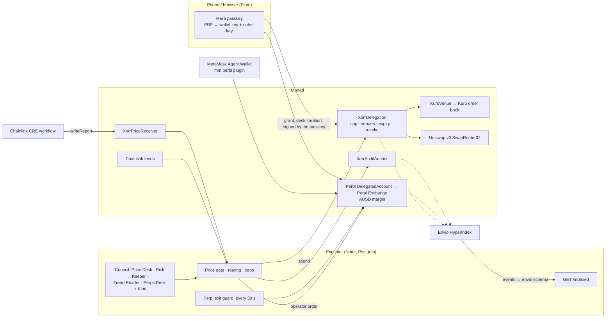

<p align="center">
  
</p>

# xorr — a council of AI agents that trades for you on Monad, inside a permission you can revoke

**Built for [Monad Metropolis](https://monad.xyz/developers/hackathons/metropolis) · track: Onchain Finance & Trading.**

Nobody can watch a market all night. xorr lets a council of AI agents do it for you — every trade voted on first, every
vote shown beside the transaction it produced, and none of it able to touch more than you allowed, because the chain
enforces the limit. On Monad a council can deliberate and still fill at the price it voted on: blocks land every 400 ms.

**Demo — the full tour (1:50, 7 Oct):** [`docs/demo/flows/00-full-tour.mp4`](docs/demo/flows/00-full-tour.mp4), recorded live
on a fork of Monad mainnet by `npm run demo:record`, captioned, waits cut. And each flow on its own, cut from the same run:
[onboarding and the passkey](docs/demo/flows/01-onboarding-passkey.mp4) ·
[funding](docs/demo/flows/02-funding.mp4) ·
[the permission and the council](docs/demo/flows/03-permission-and-council.mp4) ·
[a buy routed Kuru or Uniswap](docs/demo/flows/04-buy-kuru-or-uniswap.mp4) ·
[the Perpl desk, long and close](docs/demo/flows/05-perpl-desk-long-and-close.mp4) ·
[History, indexed by Envio](docs/demo/flows/06-history-envio.mp4) ·
[hold to stop](docs/demo/flows/07-stop.mp4). The 24 Sep cut with Perpl on Monad testnet:
[`docs/demo/xorr-monad-demo.mp4`](docs/demo/xorr-monad-demo.mp4) (2:59).

**Every screen** — 103 of them at phone and desktop size, with real data — in [`docs/screens/`](docs/screens/) (the gallery,
`docs/screens/index.html`, opens from a checkout):
contact sheets per area in [`docs/screens/sheets/`](docs/screens/sheets/), each scored in
[`docs/screens/REVIEW.md`](docs/screens/REVIEW.md), and the UI before the 6–7 Oct redesign beside today's in
[`then-and-now.png`](docs/screens/sheets/then-and-now.png).
**For judges:** per bounty, with the portal's fields and a 3-minute script — [`docs/SUBMISSION.md`](docs/SUBMISSION.md);
every component's status from a real run — [`docs/TEST-PLAN-ZERO-MOCK.md`](docs/TEST-PLAN-ZERO-MOCK.md).

**Try it in one command** (needs Node 20+, Node 22 for the indexer, Foundry, Postgres):

```bash
sh infra/monad-fork/local-stack.sh refork   # fork Monad mainnet, deploy, grant, Perpl keeper, executor, Envio, web → http://localhost:8092
```

## Why Monad

- **A council can deliberate and still fill at the price it voted on.** Four desks read Chainlink, Kuru's book, Uniswap
  and Perpl funding, vote, and the order lands in the next 400 ms block — so the gate that refuses a fill more than
  150 bps from Chainlink holds, instead of refusing every round that took a few seconds to decide.
- **A real on-chain order book to route against.** Kuru is a central-limit order book on chain, which only works with
  fast, cheap blocks; every xorr order measures Kuru against Uniswap v3 through the contract and takes the better one.
- **Perps with the permission model built in.** Perpl's `DelegatedAccount` lets an operator trade and never withdraw —
  exactly the shape of a revocable agent permission, enforced by Perpl's own contract.
- **Cheap enough to check everything on chain.** The daily cap is checked by the contract on every spend, each owner's
  agent has its own operator key, and every wallet's audit log is anchored hourly — costs that would sink the design
  elsewhere.
- **EVM, unchanged.** `XorrDelegation` and the executor came across from the Arbitrum build without a line of contract
  change; Foundry, viem and Sourcify (MonadVision) work as they do everywhere. One Monad-specific detail shaped the code:
  Monad bills the gas *limit*, so estimates are padded 10%, not 30%.

## Architecture



The owner's passkey signs the permission once; from then on the executor's agents trade inside it, and the chain refuses
anything past it — a raw spend over the cap or after a revoke is mined as a revert. The executor's design, carried over
from the earlier builds: [`docs/ARCHITECTURE.md`](docs/ARCHITECTURE.md).

## What works today

**Sign in with a passkey (Mera).** The account is derived from the passkey on the device — PRF output → BIP-39 →
`m/44'/60'/0'/0/0` — so the same passkey gives the same wallet on any device, and nothing that can sign is stored. The
executor verifies a signed challenge and issues its own session; signatures come from a Mera signing session that opens
for 15 minutes (Settings shows the countdown and a lock), then asks the passkey once more. A second key from the same
passkey, under its own PRF salt, encrypts **private notes** on each trade: the server stores ciphertext it cannot read,
and the passkey opens them on any device. (Web; the phone app needs a passkey domain and a development build. Email
sign-in through Privy remains for people without a PRF passkey.)

**Spot fills on Kuru's order book.** `contracts/src/KuruVenue.sol` lets the delegation fill through Kuru's native-MON
books (it takes the market order and forwards WMON or USDC to the owner, where the contract checks the floor). The
executor measures Kuru and Uniswap through the contract in a simulation and takes whichever delivers more. On the fork:
a WMON sale filled on Kuru for 49.91 USDC (`0x8244ec4c…`) and a $50 buy for 2,109.62 WMON (`0xe8397cea…`).

**Every buy is price-checked.** A council round and a buy placed by hand both compare the fill with Chainlink on Monad
and refuse past 150 bps or a stale round, naming the numbers ("The fill ($87,450.81, Uniswap v3 …) is 469 bps from
Chainlink ($83,532.97) …").

Proven on a fork of Monad mainnet (chain 143, block ~107.4M), through the executor's own code, with Monad's real USDC,
real Uniswap v3 pools and the real router (`docs/evidence/prove-monad-fork-2026-09-24.txt`):

1. **A fresh wallet is funded** with Circle's USDC from the fork faucet.
2. **The owner grants a permission** — one transaction on `XorrDelegation`: $100 a day, an end date, and the one venue the
   agents may use (Uniswap's SwapRouter02 on Monad).
3. **An agent buys $50 of MON** — 2,065.82 WMON at $0.02416, delivered to the owner's wallet; the contract holds nothing.
4. **A $60 order is refused twice**: by the executor ("$50.00 is left"), and — sent raw, past every off-chain check — by
   the contract, mined as a revert: `DailyCapExceeded(60000000, 50000000)`.
5. **The position is closed** back to 49.70 USDC in the owner's wallet.
6. **The owner revokes.** The executor refuses the next order; a raw spend reverts with `PolicyRevoked()`.

**On Monad testnet, for real** (chain 10143, `docs/evidence/prove-perpl-desk-testnet-2026-09-24.txt`): `XorrDelegation`
is deployed and Sourcify-verified, settling in Agora's AUSD. Agents trade **Perpl** perps through **Perpl's own
`DelegatedAccount`**: the owner owns the desk and alone can withdraw; xorr's agent key is its operator, which can trade
and can never withdraw.

7. **A desk is created** from the owner's EIP-712 signature (`0xa21F…98b5`), funded with 150 AUSD, Perpl account #692.
8. **The agent opens and closes a $100 MON long at 2x** through the desk (`0xa2e9cb77…`, `0x3f0b0aa6…`).
9. **The owner removes the operator.** The executor refuses the next order, and a raw operator order is mined as a
   revert (`OnlyOwnerOrOperator`). The owner withdraws 149.32 AUSD.
10. The same flow ran from the app (desk `0x3323…11b8`): fund, create, long 2,066 MON, hold to stop, resume, close,
    withdraw 149.80 AUSD.

**The council votes on Monad's own numbers.** Round #2 on the fork, from the Council screen: the price desk set Chainlink
MON/USD ($0.02393) against the Uniswap fill ($0.02409) and Kuru's mid ($0.02394), 66 bps apart; the risk keeper checked the
on-chain cap; the perps desk read Perpl funding (MON and ETH longs paying 0.0056%/h) and voted no. Approved 2–1 and
executed: 1,037.94 WMON to the owner (`0x6289f268…c9c121`). On testnet an approved round opens a 1x long on the desk.

**MON priced three independent ways**, live from Monad mainnet (`GET /monad/crosscheck`): Uniswap v3's pool, the mid of
Kuru's on-chain order book, and Chainlink's MON/USD feed — $0.024112, $0.024117 and $0.024118 when last read, 2.2 bps
apart. Perpl's perpetual markets (`GET /monad/perpl`): mark, book, open interest and funding for BTC, MON, ETH, SOL and more.

**Perpl risk, on public data** (`/perpl`, `GET /monad/perpl/risk`). On the build's own Perpl (testnet on the testnet
build), per market: every funding payment over 24 hours or 7 days drawn above or below the line, what a long paid and its
yearly pace, the price move and trades, open interest in dollars, spread and staleness. Above them, what deserves a look —
crowded funding, big moves, wide books, stale marks — and, signed in, your positions' distance to liquidation and what each
pays in funding an hour.

**Standing exits on every Perpl desk** (`server/src/monad/perpl-exits.ts`). The scheduler checks every open position each
tick against the owner's rules — close within 10% of liquidation, at a loss of half the margin, at a take-profit, or when a
losing position pays funding at 50% a year or more — and closes through the desk. Set on Perps, with a dry run of what each
rule would do now.

**A MON/USD price on Monad testnet, by Chainlink CRE** ([`cre/`](cre/README.md)). Testnet has no Chainlink MON/USD feed.
A CRE workflow reads Perpl's MON mark (HTTP, consensus), Kuru's book and Chainlink's mainnet feed, and writes their median
— or a halt, when the markets drift from Chainlink — to `XorrPriceReceiver` on testnet; the price gate anchors MON to it.

**Perpl for the MetaMask Agent Wallet** ([`mm-plugin-perpl/`](mm-plugin-perpl/README.md)): `mm perpl markets · risk ·
account · deposit · open · close`, every transaction simulated first and sent through MetaMask's policy-gated executor.

**On-chain record, indexed by Envio** ([`indexer/`](indexer/README.md)): HyperIndex v3 over the delegation, the audit
anchor and Perpl's desk factory, with per-owner, per-day, per-venue and per-desk entities derived as events arrive, synced
over RPC into the executor's Postgres; History leads with it.

**Kimi in the council** (`server/src/council/strategist.ts`): a fifth seat that weighs the four desks and decides split
rounds — no veto, and no number a desk did not report. Without `MOONSHOT_API_KEY` the seat does not sit and the Council
screen says so ("not configured"); there is no stand-in answer.

**Mera on the phone** (`src/auth/mera/platform.native.ts`): the same passkey account in the native app through Mera's
React Native client, once a passkey domain serves [`docs/passkey-domain/`](docs/passkey-domain/README.md).

**Why route through Kuru, measured** ([`docs/KURU.md`](docs/KURU.md)): what a MON sale delivers on Kuru's book against
Uniswap's best pool on mainnet, at $10 to $20,000 — Kuru ahead at small sizes, the winner flipping within a minute at
$1k–$5k, which is why every order measures both.

What is next, phase by phase, is in [`PLAN.md`](PLAN.md); going live on testnet and hosting, step by step, in
[`docs/DEPLOY-LATER.md`](docs/DEPLOY-LATER.md). The hackathon research and the bounties we build for are in
[`docs/METROPOLIS.md`](docs/METROPOLIS.md).

## Sponsors, and exactly how each is used

| | Used for | Where |
|---|---|---|
| **Monad** (143 / 10143) | the chain the permission lives on and every fill settles on; a fork of mainnet for real fills with test money | `server/src/evm/chains.ts`, `infra/monad-fork/` |
| **Uniswap v3 on Monad** | spot venue: QuoterV2 quotes, SwapRouter02 fills through `XorrDelegation.spend()` | `server/src/venues/uniswap.ts` |
| **Perpl** | agents trade perps through Perpl's `DelegatedAccount` (operator trades, never withdraws); standing exits; funding read by the council; the risk tool on its public API (context, funding history, candles) | `server/src/monad/perpl-desk.ts`, `server/src/monad/perpl-exits.ts`, `server/src/monad/perpl-risk.ts`, `app/perps.tsx`, `app/perpl.tsx` |
| **Kuru** | spot fills through `KuruVenue` when Kuru's book delivers more than Uniswap; the MON/USDC book read by the council's price desk | `contracts/src/KuruVenue.sol`, `server/src/venues/kuru-fill.ts`, `server/src/monad/kuru.ts` |
| **Mera** | passkey accounts: the wallet key and a private-notes key, both from the passkey's PRF output; a bounded signing session | `src/auth/mera/`, `server/src/auth/passkey-session.ts` |
| **Chainlink** | MON/USD, ETH/USD, BTC/USD, USDC/USD, AUSD/USD on Monad; the price gate on every buy (council and manual), the trend, AUSD's peg; a **CRE** workflow that writes MON/USD to testnet for the gate | `server/src/monad/chainlink.ts`, `server/src/council/monad-inputs.ts`, `cre/`, `contracts/src/XorrPriceReceiver.sol` |
| **MetaMask Agent Wallet** | an `mm` plugin: Perpl perps for the agent wallet, through `ctx.walletExecutor` | `mm-plugin-perpl/` |
| **Agora AUSD** | the testnet settlement token and the desk's margin; named on Home, Deposit and Portfolio with its Chainlink peg; Agora's faucet (else a reserve) in the app's test funds | `server/src/evm/chains.ts`, `server/src/monad/perpl-routes.ts` |
| **Envio** | HyperIndex v3 over the delegation, the audit anchor and Perpl's desk factory (each desk registered as it is created); per-owner, per-day, per-venue and per-desk entities; History reads it through `GET /indexed` | `indexer/`, `server/src/routes/indexed.ts`, `app/history.tsx` |
| **Kimi (Moonshot)** | the council's Strategist seat: weighs the four desks and decides split rounds; no veto, no number a desk did not report | `server/src/council/strategist.ts` |
| **Sourcify (MonadVision)** | contract verification on deploy | `contracts/deploy-testnet.sh` |

## Deployments

| | Address |
|---|---|
| Monad testnet `XorrDelegation(AUSD)` | [`0x5995925de0169574365cc7f6b65f765275b0bd4b`](https://testnet.monadvision.com/address/0x5995925de0169574365cc7f6b65f765275b0bd4b) — Sourcify-verified |
| Monad testnet `XorrAuditAnchor` | [`0x5a717b204c77bfba8805ffe1f382b074a3d26203`](https://testnet.monadvision.com/address/0x5a717b204c77bfba8805ffe1f382b074a3d26203) |
| Perpl testnet desk (proof) | [`0xa21Fa8708008890565817c9d73538Cabc3d098b5`](https://testnet.monadvision.com/address/0xa21Fa8708008890565817c9d73538Cabc3d098b5), Perpl account #692 |
| `KuruVenue` (fork of Monad mainnet) | deployed by `fork-bootstrap-evm.ts` on every fork (`KURU_VENUE_ADDRESS`) |
| Executor, web, indexer, CRE receiver on testnet | on hold until the owner's go — runbook: [`docs/DEPLOY-LATER.md`](docs/DEPLOY-LATER.md) |

## Run it

**The whole product locally, one command** (6 Oct): a fork of Monad mainnet at the head, our contracts and a grant on it,
a keeper that lets Perpl's real Exchange trade on the fork, the executor, the Envio indexer and the web app — then the
browser journey and a crawl of every screen:

```bash
sh infra/monad-fork/local-stack.sh refork        # up | down | refork; stops only what it started
npm run e2e:fork                                 # passkey → fund → permission → buy → History (Envio) → Perpl long/close → stop
npm run e2e:flows                                # the rest: limits, close, private note, send, council, a hired agent, signing lock, executor down
npm run e2e:email                                # email sign-in (Privy) with a test account's real one-time code
npm run e2e:crawl                                # all 116 screens at 375 px, signed in: console, network, error states, overflow, accessibility
sh infra/monad-fork/local-stack.sh down          # stops only what it started
```

Each step fails on any console error or API response ≥ 400. Evidence from the 6 Oct runs, in `docs/evidence/`:
the journey (9 steps, 0 console errors, 3.1–5.6 s to the first transaction), the flows (9 of 9 pass), email sign-in
(Privy, a real one-time code), the crawl (90 screens render, 26 hidden on Monad by design, 0 failures, no unnamed control
or image without alt), and the quality gate (every suite, typecheck, lint, slither triaged, secret scan). Per bounty, for judges: [`docs/SUBMISSION.md`](docs/SUBMISSION.md).

Piece by piece:

```bash
npm ci && (cd server && npm ci)
cd contracts && forge build && forge test && cd ..

# A fork of Monad mainnet, and our contracts on it
# The entrypoint saves the chain to FORK_DATA_DIR and resumes it; keep that off /tmp, which macOS empties on restart
FORK_DATA_DIR=~/.xorr-monad-fork PORT=8547 sh infra/monad-fork/entrypoint.sh     # or: anvil --fork-url https://rpc.monad.xyz --chain-id 143
cd server
export DELEGATE_PRIVATE_KEY=0x…                                   # the executor's key (never commit it)
XORR_CHAIN=monad-fork FORK_RPC=http://127.0.0.1:8547 npx tsx src/fork-bootstrap-evm.ts <your wallet>   # writes .env.fork
# Optional: your wallet's grant without signing it ($/day), by impersonation, which only a fork allows
set -a && . ./.env.fork && set +a && FORK_RPC=http://127.0.0.1:8547 npx tsx src/fork-grant.ts <your wallet> 1600

# The proof above
set -a && . ./.env.fork && set +a
createdb xorr_metropolis && DATABASE_URL=postgres://localhost:5432/xorr_metropolis npx tsx src/db/migrate.ts
PRIVY_APP_ID=… PRIVY_APP_SECRET=… DATABASE_URL=postgres://localhost:5432/xorr_metropolis npx tsx src/prove-monad.ts

# The executor, and the app against it
PRIVY_APP_ID=… PRIVY_APP_SECRET=… DATABASE_URL=… npx tsx src/index.ts   # :8787, /health, /monad/crosscheck
cd .. && npm run start:fork

# Live reads against Monad mainnet
cd server && LIVE=1 npx vitest run src/monad/monad.live.test.ts
```

Deploy to Monad testnet (needs test MON in the deployer named in `server/.env.deployer-monad`):
`cd contracts && ./deploy-testnet.sh monad-testnet`.

## Honest limits

- **Everything since 24 Sep runs on a fork; testnet waits for the owner's go.** Spot trades fill against Monad mainnet's
  real state on an anvil fork (Uniswap's testnet addresses hold no code). Perpl orders filled on Perpl's testnet on
  24 Sep and fill on the fork through Perpl's real Exchange, kept trading by a local keeper that posts Perpl's live marks
  (`server/src/fork/perpl-keeper.ts`, fork only). On a fork the price gate compares against the fork's own Chainlink and
  Kuru, aged at the fork block. Nothing here spends real funds.
- **Monad has no tokenized stocks** (official token list, 2026-09-24), so the Stock Token screens of the Arbitrum build
  are hidden here, and the agents trade MON and the majors.
- **Mera on the phone is built, not yet run on a device.** It needs the passkey domain's two files served and a
  development build; on the web it runs end to end. Privy's email sign-in remains for people without a PRF passkey.
- **Built, not yet run against the real thing:** the CRE workflow has not been simulated (the CRE CLI refuses every command
  until `cre login`), and the receiver is not deployed (~0.12 test MON); the `mm perpl` trading commands need `mm login`
  and a funded agent wallet; Kimi needs `MOONSHOT_API_KEY`. Each says so in its own README, and the app says so where it
  shows them.
- **Test MON is scarce.** The faucet is rate-limited; the testnet runs wait on the keys being topped up
  ([`docs/DEPLOY-LATER.md`](docs/DEPLOY-LATER.md) §1 has the amounts).

## Disclosures (Metropolis rules)

**Foundation.** This repository starts from the earlier xorr builds — Base, then Solana, X Layer and Arbitrum, all made in
September 2026 by the same author. The root commit (`5681467`, "Initial commit") is that code exactly as the Arbitrum build
left it: the `XorrDelegation` and `XorrAuditAnchor` contracts, the Node executor, the agent council and the Expo app.
Everything after the root commit is the Monad work. The previous README is `docs/archive/README-arbitrum.md`.

**New in the build window, for Metropolis** (24 Sep – 13 Oct; 100 commits after the root, ~16,000 lines added, not
counting lockfiles, evidence and media — `git diff --stat 5681467`):

| Area | New |
|---|---|
| Chain | Monad mainnet, testnet and a fork of mainnet as chains both sides know; the fork's infrastructure and one-command stack (`infra/monad-fork/`) |
| Contracts | `KuruVenue` (fills through Kuru's book), `XorrPriceReceiver` (a CRE `ReceiverTemplate`); the testnet deploy, Sourcify-verified |
| Perpl | desks through Perpl's `DelegatedAccount`, caps checked before signing, standing exits, the risk tool, the fork keeper (`server/src/monad/perpl-*.ts`, `app/perps.tsx`, `app/perpl.tsx`) |
| Kuru, Chainlink, Uniswap on Monad | routing measured per order and shown per fill; the price gate on every buy; MON priced three ways |
| Mera | passkey accounts on web and native, the signing session and its lock, private notes under a second PRF key (`src/auth/mera/`, `server/src/auth/passkey-session.ts`) |
| Council | Monad readings for every desk; Kimi as the Strategist |
| Envio | the HyperIndex indexer and `GET /indexed` (`indexer/`) |
| Chainlink CRE | the MON/USD workflow for testnet (`cre/`) |
| MetaMask | the `mm perpl` Agent Wallet plugin (`mm-plugin-perpl/`) |
| Tests | the browser journey, flows and the 375 px crawl (`e2e/web/`); fork proofs for the delegation and the Perpl desk |

**AI tools.** This project is built with AI coding assistance: Claude Code (Anthropic) wrote and ran much of the code,
the tests and the on-chain proofs under the author's direction, and is credited as co-author on those commits.

## Licence

MIT — see [`LICENSE`](LICENSE).
